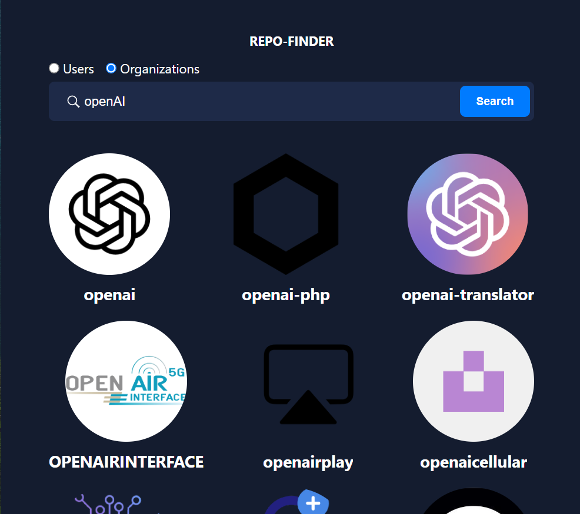

# 🚀 Repo Finder

A modern web application built with **Vite** and **JavaScript** to search for GitHub users and organizations. It displays profiles and repositories in an interactive, responsive, and user-friendly interface.

## ✨ Features

- 🔍 **GitHub User Search**: Search for GitHub users or organizations by username and view their profiles instantly.  
- 🧩 **Clickable Profile Cards**: Interactive cards linking directly to GitHub profiles.  
- 📦 **Show More Pagination**: Seamlessly load more results with a “Show More” button.  
- 📱 **Responsive Design**: Optimized for all screen sizes – mobile and desktop.  
- ⚠️ **Error Handling**: User-friendly messages for failed API requests.  
- ⚡ **Modern JavaScript**: Uses  modular structure for clean, maintainable code.

---

## 🔗 Live Demo

👉 [Check out the live demo here](https://khaledkhoderdev.github.io/Repo-finder/)  

---

## 🛠️ Technologies Used

- ⚙️ [Vite](https://vitejs.dev/) – Fast, modern frontend build tool  
- 🧠 JavaScript (ES Modules) – For dynamic functionality and modular code  
- 🌐 [GitHub API](https://docs.github.com/en/rest) – Real-time user & repo data  
- 🎨 HTML5 & CSS3 – Clean and responsive UI  
- 💅 Sass/SCSS  – For maintainable styling  
- 🗂️ Git & GitHub – Version control and hosting

---

## 📦 Installation

To run the project locally:

 1. Clone the repository
git clone https://github.com/KhaledKhoderDev/Repo-finder.git

 2. Navigate to the project directory
cd Repo-finder

 3. Install dependencies
npm install

 4. Start the development server
npm run dev

 5. Build for Production
```npm run build```
The production-ready files will be in the dist folder.

---

## 🚀 Deployment

This project is deployed on **GitHub Pages** via **GitHub Actions**.

**Steps:**

1. **Configure `vite.config.js`**  
   In your `vite.config.js`, set the correct `base` path:
   ```js
   // vite.config.js
   export default {
     base: '/repo-finder/',
     // ...other config
   }```
   Replace repo-finder with your actual repository name if different.

2. **Push your changes**:
   ```
   git add .
   git commit -m "Deploy to GitHub Pages"
   git push origin main```

3. **Verify the workflow**:
Make sure the GitHub Actions workflow file
.github/workflows/deploy.yml
runs successfully under the Actions tab.

4. **Visit your live site**:
 [https://your_username.github.io/Repo-finder/](https://your_username.github.io/Repo-finder/)

---

## Project structure:
```REPO_FINDER/
├── .github/
│   └── workflows/
│       └── deploy.yml
├── assets/
│   └── search-icon.svg
├── dist/
│   ├── assets/
│   │   ├── index-7YHga....js
│   │   └── index-HwiNW....css
│   ├── index.html
│   └── vite.svg
├── node_modules/
├── public/
│   └── vite.svg
├── scripts/
│   ├── elements.js
│   ├── getMessage.js
│   ├── main.js
│   ├── performSearch.js
│   ├── setLoadingState.js
│   ├── setMessage.js
│   ├── setSearchResults.js
│   └── showMore.js
├── .gitignore
├── index.html
├── package-lock.json
├── package.json
├── styles.scss
└── vite.config.js
```
---

## 🧠 How It Works:
- The user enters a GitHub username.

- The app makes a request to the GitHub API.

- If the user or organization exists, their profile and repositories are displayed.

- Additional results are loaded using the Show More button.

## 🙌 Contributing
Contributions are welcome! To contribute:

1. Fork the repo

2. Make a new branch: ```git checkout -b feature/my-feature ```

4. Commit changes: ```git commit -m "Add my feature" ```

5. Push to the branch: ```git push origin feature/my-feature ```

6. Open a Pull Request

##  Acknowledgments:
Built with ❤️ using the GitHub API,Vite,HTML,Sass,JavaScript

## 📬 Contact:
GitHub: @KhaledKhoderDev


